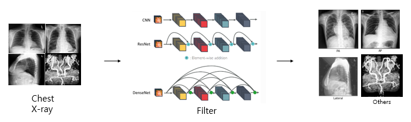

# CXR_ViewCLS
 
**DEVELOPED BY**: MI2RL (울산대학교)


## Abstract
- PA, AP, Lateral, Others Classification
- Filter model (resnet, densensenet, efficientnet) was used to classify into PA, AP, Lateral, and Others through chest X-ray data.

- Learning data is conducted using AMC (AsanMedicalCenter) 25,700 CXR Image, CheXpert 19,800 CXR Image, and MIMIC-CXR 19,800 CXR Image.

- Improve the accuracy of the algorithm by using bagging ensemble technique.

- Accuracy is 98%, showing that model performance is very excellent.

## Description



## Usage Notes

### Requirements

- tensorflow 2.0.0
- matplotlib 3.3.4
- SimpleITK 1.2.4

```bash
%cd Test
!pip install -r 'requirements.txt'
```

### Inference

```bash
%cd nnUNet_v2_inference_lowres
!python DataExtraction_CSV_subprocess.py -input_dcm '../dcm_input' -gpu_num 1
```


- i: Input cxr image folder location.
- gpu: Please enter the gpu number you will use


The output results are saved as a csv file in the location corresponding to parameter i.

## Tag 

## Reference

[MIMIC CXR](https://physionet.org/content/mimic-cxr/2.0.0/)

[CheXpert](https://aimi.stanford.edu/datasets/chexpert-chest-x-rays)


## Files
⬇️ [Download SW](https://github.com/mi2rl/DataCuration/tree/386eafa30667b9558f4d24ee702955b75d36a4fd/CXR_ViewCLS)


## Contributing

If you'd like to contribute, or have any suggestions for these guidelines, you can contact us at junegoo.lee@gmail.com or open an issue on this GitHub repository.


